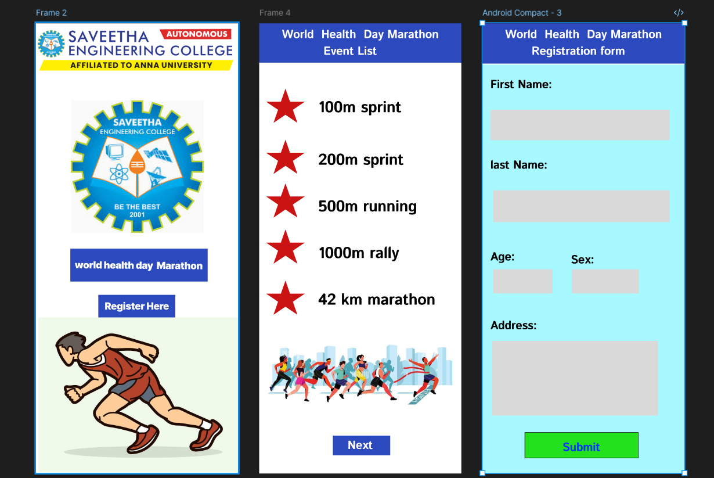

# Ex08 Event Registration Web Application
## Date:

## AIM:
To design, develop and deploy a web application for event registration using Figma UI tool.

## UI DESIGN TOOL:
Figma

## DESIGN STEPS:

### Step 1:
Use frames to represent screens or sections.

### Step 2:
Add column grids for consistent spacing and alignment.

### Step 3:
Insert shapes, text, buttons, and icons.

### Step 4:
Use Auto Layout for flexible, responsive design.

### Step 5:
Define color, text, and effect styles globally for consistency.

### Step 6:
Name layers logically and group related elements.

### Step 6:
Link frames to show navigation or interactions.

### Step 7:
Select the specific frame while generating code using Anima plugin.

## CODE:
```
html
<!DOCTYPE html>
<html>
  <head>
    <meta name="viewport" content="width=device-width, initial-scale=1" />
    <meta charset="utf-8" />
    <link rel="stylesheet" href="globals.css" />
    <link rel="stylesheet" href="style.css" />
  </head>
  <body>
    <div class="frame">
      <div class="frame">
        <div class="android-compact">
          
          <div class="rectangle"></div>
          
          <div class="div"></div>
          <div class="text-wrapper">Register Here</div>
          <div class="world-health-day">world health day&nbsp;&nbsp;Marathon</div>
          
        </div>
      </div>
    </div>
  </body>
</html>

css
.frame {
  width: 412px;
  display: flex;
}

.frame .android-compact {
  width: 412px;
  height: 917px;
  position: relative;
  background-color: #ffffff;
}

.frame .image {
  top: 0;
  left: 0;
  width: 412px;
  height: 107px;
  aspect-ratio: 4.12;
  position: absolute;
  object-fit: cover;
}

.frame .rectangle {
  position: absolute;
  top: 459px;
  left: 70px;
  width: 280px;
  height: 67px;
  background-color: #2c49bd;
}

.frame .img {
  top: 599px;
  left: 5px;
  width: 407px;
  height: 318px;
  aspect-ratio: 1.29;
  position: absolute;
  object-fit: cover;
}

.frame .div {
  position: absolute;
  top: 553px;
  left: 127px;
  width: 157px;
  height: 46px;
  background-color: #2c49bd;
}

.frame .text-wrapper {
  position: absolute;
  top: 562px;
  left: 140px;
  height: 28px;
  display: flex;
  align-items: center;
  justify-content: center;
  font-family: "Inter-Black", Helvetica;
  font-weight: 900;
  color: #ffffff;
  font-size: 20px;
  letter-spacing: -0.40px;
  line-height: 28.0px;
  white-space: nowrap;
}

.frame .world-health-day {
  position: absolute;
  top: 473px;
  left: 79px;
  width: 262px;
  height: 40px;
  display: flex;
  align-items: center;
  justify-content: center;
  transform: rotate(0.43deg);
  font-family: "Inter-Black", Helvetica;
  font-weight: 900;
  color: #ffffff;
  font-size: 20px;
  letter-spacing: -0.40px;
  line-height: 28.0px;
}

.frame .image-2 {
  top: 157px;
  left: calc(50.00% - 135px);
  width: 271px;
  height: 270px;
  aspect-ratio: 1;
  position: absolute;
  object-fit: cover;
}


html
<!DOCTYPE html>
<html>
  <head>
    <meta name="viewport" content="width=device-width, initial-scale=1" />
    <meta charset="utf-8" />
    <link rel="stylesheet" href="globals.css" />
    <link rel="stylesheet" href="style.css" />
  </head>
  <body>
    <div class="frame">
      <div class="android-compact">
        <div class="rectangle"></div>
        <div class="world-health-day">
          World&nbsp;&nbsp;Health&nbsp;&nbsp;Day Marathon<br />&nbsp;&nbsp;&nbsp;&nbsp;&nbsp;&nbsp;&nbsp;&nbsp;&nbsp;&nbsp;
          Event List
        </div>
        
        
        
        
        
        <div class="text-wrapper">100m sprint</div>
        <div class="div">200m sprint</div>
        <div class="text-wrapper-2">500m running</div>
        <div class="text-wrapper-3">1000m rally</div>
        <div class="text-wrapper-4">42 km marathon</div>
        <div class="text-wrapper-5">Next</div>
        <div class="rectangle-2"></div>
        <div class="text-wrapper-6">Next</div>
      </div>
    </div>
  </body>
</html>

css

.frame {
  width: 100%;
  min-width: 412px;
  min-height: 917px;
  display: flex;
}

.frame .android-compact {
  width: 412px;
  height: 917px;
  position: relative;
  background-color: #ffffff;
  overflow: hidden;
}

.frame .rectangle {
  top: 0;
  left: 0;
  width: 412px;
  height: 80px;
  position: absolute;
  background-color: #2c49bd;
}

.frame .world-health-day {
  position: absolute;
  top: 6px;
  left: 46px;
  height: 68px;
  display: flex;
  align-items: center;
  justify-content: center;
  font-family: "Istok Web-Bold", Helvetica;
  font-weight: 700;
  color: #ffffff;
  font-size: 24px;
  letter-spacing: -0.48px;
  line-height: 33.6px;
}

.frame .star {
  top: 133px;
  position: absolute;
  left: 14px;
  width: 79px;
  height: 70px;
}

.frame .img {
  top: 524px;
  position: absolute;
  left: 14px;
  width: 79px;
  height: 70px;
}

.frame .star-2 {
  top: 420px;
  position: absolute;
  left: 14px;
  width: 79px;
  height: 70px;
}

.frame .star-3 {
  top: 326px;
  position: absolute;
  left: 14px;
  width: 79px;
  height: 70px;
}

.frame .star-4 {
  top: 237px;
  position: absolute;
  left: 14px;
  width: 79px;
  height: 70px;
}

.frame .text-wrapper {
  position: absolute;
  top: 149px;
  left: 120px;
  height: 45px;
  display: flex;
  align-items: center;
  justify-content: center;
  font-family: "Istok Web-Bold", Helvetica;
  font-weight: 700;
  color: #000000;
  font-size: 32px;
  letter-spacing: -0.64px;
  line-height: 44.8px;
  white-space: nowrap;
}

.frame .div {
  position: absolute;
  top: 256px;
  left: 120px;
  height: 45px;
  display: flex;
  align-items: center;
  justify-content: center;
  font-family: "Istok Web-Bold", Helvetica;
  font-weight: 700;
  color: #000000;
  font-size: 32px;
  letter-spacing: -0.64px;
  line-height: 44.8px;
  white-space: nowrap;
}

.frame .text-wrapper-2 {
  position: absolute;
  top: 351px;
  left: 120px;
  height: 45px;
  display: flex;
  align-items: center;
  justify-content: center;
  font-family: "Istok Web-Bold", Helvetica;
  font-weight: 700;
  color: #000000;
  font-size: 32px;
  letter-spacing: -0.64px;
  line-height: 44.8px;
  white-space: nowrap;
}

.frame .text-wrapper-3 {
  position: absolute;
  top: 446px;
  left: 120px;
  height: 45px;
  display: flex;
  align-items: center;
  justify-content: center;
  font-family: "Istok Web-Bold", Helvetica;
  font-weight: 700;
  color: #000000;
  font-size: 32px;
  letter-spacing: -0.64px;
  line-height: 44.8px;
  white-space: nowrap;
}

.frame .text-wrapper-4 {
  position: absolute;
  top: 541px;
  left: 120px;
  height: 45px;
  display: flex;
  align-items: center;
  justify-content: center;
  font-family: "Istok Web-Bold", Helvetica;
  font-weight: 700;
  color: #000000;
  font-size: 32px;
  letter-spacing: -0.64px;
  line-height: 44.8px;
  white-space: nowrap;
}

.frame .text-wrapper-5 {
  position: absolute;
  top: 788px;
  left: 315px;
  width: 13px;
  height: 136px;
  display: flex;
  align-items: center;
  justify-content: center;
  font-family: "Istok Web-Bold", Helvetica;
  font-weight: 700;
  color: #ffffff;
  font-size: 24px;
  letter-spacing: -0.48px;
  line-height: 33.6px;
}

.frame .rectangle-2 {
  top: 840px;
  left: 150px;
  width: 117px;
  height: 40px;
  position: absolute;
  background-color: #2c49bd;
}

.frame .text-wrapper-6 {
  position: absolute;
  top: 843px;
  left: 180px;
  height: 34px;
  display: flex;
  align-items: center;
  justify-content: center;
  font-family: "Istok Web-Bold", Helvetica;
  font-weight: 700;
  color: #ffffff;
  font-size: 24px;
  letter-spacing: -0.48px;
  line-height: 33.6px;
  white-space: nowrap;
}

html
<!DOCTYPE html>
<html>
  <head>
    <meta name="viewport" content="width=device-width, initial-scale=1" />
    <meta charset="utf-8" />
    <link rel="stylesheet" href="globals.css" />
    <link rel="stylesheet" href="style.css" />
  </head>
  <body>
    <div class="android-compact">
      <div class="rectangle"></div>
      <div class="world-health-day">
        World&nbsp;&nbsp;Health&nbsp;&nbsp;Day Marathon<br />&nbsp;&nbsp;&nbsp;&nbsp;&nbsp;&nbsp; Registration form
      </div>
      <div class="div"></div>
      <div class="text-wrapper">Address:</div>
      <div class="text-wrapper-2">Sex:</div>
      <div class="text-wrapper-3">Age:</div>
      <div class="text-wrapper-4">last Name:</div>
      <div class="text-wrapper-5">First Name:</div>
      <div class="rectangle-2"></div>
      <div class="rectangle-3"></div>
      <div class="rectangle-4"></div>
      <div class="rectangle-5"></div>
      <div class="rectangle-6"></div>
      <div class="rectangle-7"></div>
      <div class="text-wrapper-6">Submit</div>
    </div>
  </body>
</html>

css

.android-compact {
  background-color: #ffffff;
  width: 100%;
  min-width: 412px;
  min-height: 917px;
  position: relative;
}

.android-compact .rectangle {
  position: absolute;
  top: 0;
  left: 0;
  width: 412px;
  height: 82px;
  background-color: #2c49bd;
}

.android-compact .world-health-day {
  position: absolute;
  top: 6px;
  left: 46px;
  height: 68px;
  display: flex;
  align-items: center;
  justify-content: center;
  font-family: "Istok Web-Bold", Helvetica;
  font-weight: 700;
  color: #ffffff;
  font-size: 24px;
  letter-spacing: -0.48px;
  line-height: 33.6px;
}

.android-compact .div {
  position: absolute;
  top: 84px;
  left: 0;
  width: 412px;
  height: 833px;
  background-color: #a7f9ff;
}

.android-compact .text-wrapper {
  position: absolute;
  top: 599px;
  left: 16px;
  height: 34px;
  display: flex;
  align-items: center;
  justify-content: center;
  font-family: "Istok Web-Bold", Helvetica;
  font-weight: 700;
  color: #000000;
  font-size: 24px;
  letter-spacing: -0.48px;
  line-height: 33.6px;
  white-space: nowrap;
}

.android-compact .text-wrapper-2 {
  position: absolute;
  top: 465px;
  left: 180px;
  height: 34px;
  display: flex;
  align-items: center;
  justify-content: center;
  font-family: "Istok Web-Bold", Helvetica;
  font-weight: 700;
  color: #000000;
  font-size: 24px;
  letter-spacing: -0.48px;
  line-height: 33.6px;
  white-space: nowrap;
}

.android-compact .text-wrapper-3 {
  position: absolute;
  top: 459px;
  left: 16px;
  height: 34px;
  display: flex;
  align-items: center;
  justify-content: center;
  font-family: "Istok Web-Bold", Helvetica;
  font-weight: 700;
  color: #000000;
  font-size: 24px;
  letter-spacing: -0.48px;
  line-height: 33.6px;
  white-space: nowrap;
}

.android-compact .text-wrapper-4 {
  position: absolute;
  top: 272px;
  left: 16px;
  height: 34px;
  display: flex;
  align-items: center;
  justify-content: center;
  font-family: "Istok Web-Bold", Helvetica;
  font-weight: 700;
  color: #000000;
  font-size: 24px;
  letter-spacing: -0.48px;
  line-height: 33.6px;
  white-space: nowrap;
}

.android-compact .text-wrapper-5 {
  position: absolute;
  top: 108px;
  left: 16px;
  height: 34px;
  display: flex;
  align-items: center;
  justify-content: center;
  font-family: "Istok Web-Bold", Helvetica;
  font-weight: 700;
  color: #000000;
  font-size: 24px;
  letter-spacing: -0.48px;
  line-height: 33.6px;
  white-space: nowrap;
}

.android-compact .rectangle-2 {
  position: absolute;
  top: 176px;
  left: 16px;
  width: 366px;
  height: 62px;
  background-color: #d9d9d9;
}

.android-compact .rectangle-3 {
  position: absolute;
  top: 340px;
  left: 22px;
  width: 360px;
  height: 65px;
  background-color: #d9d9d9;
}

.android-compact .rectangle-4 {
  position: absolute;
  top: 501px;
  left: 22px;
  width: 121px;
  height: 49px;
  background-color: #d9d9d9;
}

.android-compact .rectangle-5 {
  position: absolute;
  top: 501px;
  left: 182px;
  width: 137px;
  height: 49px;
  background-color: #d9d9d9;
}

.android-compact .rectangle-6 {
  position: absolute;
  top: 647px;
  left: 20px;
  width: 338px;
  height: 152px;
  background-color: #d9d9d9;
}

.android-compact .rectangle-7 {
  position: absolute;
  top: 833px;
  left: 86px;
  width: 232px;
  height: 53px;
  background-color: #23e01d;
  border: 1px solid;
  border-color: #000000;
}

.android-compact .text-wrapper-6 {
  position: absolute;
  top: 843px;
  left: 163px;
  width: 88px;
  height: 43px;
  display: flex;
  align-items: center;
  justify-content: center;
  font-family: "Istok Web-Bold", Helvetica;
  font-weight: 700;
  color: #0032ff;
  font-size: 24px;
  letter-spacing: -0.48px;
  line-height: 33.6px;
}
```

## OUTPUT:



## RESULT:
The program to design, develop and deploy a web application for event registration using Figma UI tool is completed successfully.
